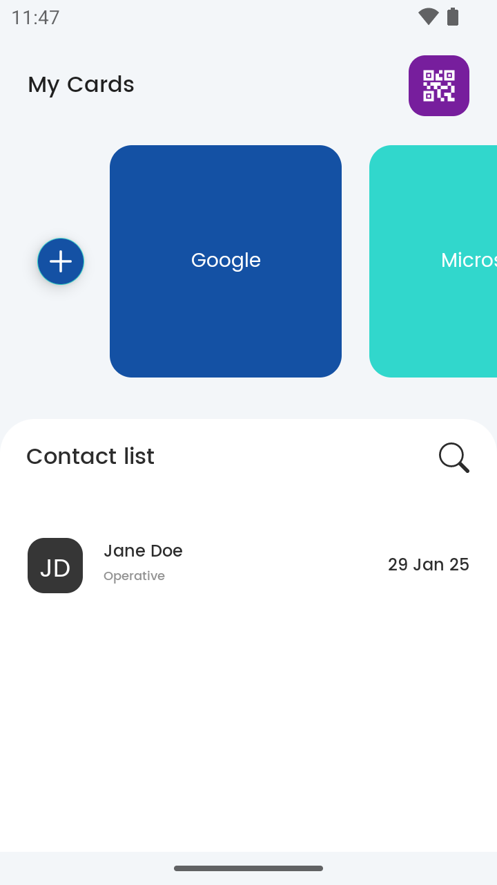
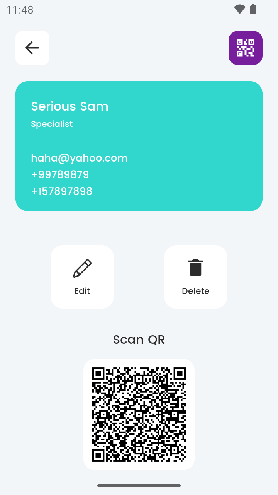

# Contact Exchange

An Android application that lets you **create contact cards** and **share them** via QR codes. Easily **scan other users’ QR codes** to import their contact details directly into your app.

## Table of Contents
1. [Features](#features)  
2. [Architecture & Branches](#architecture--branches)  
3. [Technologies Used](#technologies-used)  
4. [Screenshots](#screenshots)  
5. [Getting Started](#getting-started)
   - [Clone the Repository](#clone-the-repository)
   - [Checkout a Branch](#checkout-a-branch)
   - [Open in Android Studio](#open-in-android-studio)
   - [Requirements](#requirements)
   - [Build & Run](#build--run)
6. [Running the Tests](#running-the-tests)  
7. [Contributing](#contributing)  
8. [License](#license)  
9. [Contact](#contact)

---

## Features
- **Create Contact Cards**: Enter details (name, position, phone, email) to create personalized contact cards.
- **Share via QR**: Generate a QR code for each contact card to share quickly with others.
- **Scan & Import**: Scan someone else’s QR code and automatically import their contact info.
- **Offline Support**: All contacts are stored locally using Room database.

---

## Architecture & Branches
This repository demonstrates different Android architecture approaches. Each branch contains the **same app functionality** but uses different tech stacks and patterns:

1. **MVVM-MVI** (branch: `master`)  
   - **Kotlin**  
   - Clean Architecture + MVVM + MVI patterns  
   - **Kotlin Coroutines** / **Kotlin Flow** for asynchronous/reactive operations  
   - **Tests**: Kotlin Test, MockK, Robolectric

2. **Compose** (branch: `compose`)  
   - **Kotlin**  
   - **Jetpack Compose** for the UI  
   - In progress / partial implementation  
   - Plans to leverage the same Clean Architecture and Coroutines Flow approach

---

## Technologies Used
- **Room** (local database storage)  
- **ML Kit** for QR scanner functionality (scan contact QR codes)  
- **JUnit / Kotlin Test** for unit testing  
- **MockK** for mocking dependencies  
- **Robolectric** for Android-specific unit tests  
- **Gradle** build system

---

## Screenshots
Below are a couple of in-app views. (You can place images in a `screenshots` folder in your repo.)

<p style="text-align: center;">
  
  
</p>

---

## Getting Started

1. **Clone the repo**:
   ```bash
   git clone https://github.com/arch3rtemp/contact-exchange-android-kotlin.git
   cd contact-exchange-android-kotlin

2. **Checkout a Branch**
   For example, if you want to work on the `compose` branch:
   `git checkout compose`

3. **Open in Android Studio**
   Go to **File → Open...**
   Select the project folder you just cloned.

4. **Requirements**
   * Android Studio Meerkat or later
   * Gradle 8.x or later
   * Minimum Android SDK 21

5. **Build & Run**
   * Let Gradle Sync after opening the project.
   * Run the app on an emulator or physical device via **Run → Run App** (or the green "play" button).

6. **Running the Tests**
   * Each branch includes unit tests:
   `./gradlew test`
   Robolectric tests also run with the same command. You can check the results in Android Studio’s **Test Results** panel.

---

## Contributing
Contributions are welcome! If you'd like to contribute:
1. Fork the repository.
2. Create a new branch (`feature/awesome-improvement` or similar).
3. Commit your changes and open a Pull Request with a detailed description.
Your contribution will be reviewed, and if approved, merged into the main project.

---

## License
This project is licensed under the **MIT License**.

---

## Contact
For any questions or suggestions, feel free to reach out:
* Archil Asanishvili - <arch3r_temp@yahoo.com>
* LinkedIn - <https://www.linkedin.com/in/archil-asanishvili>
